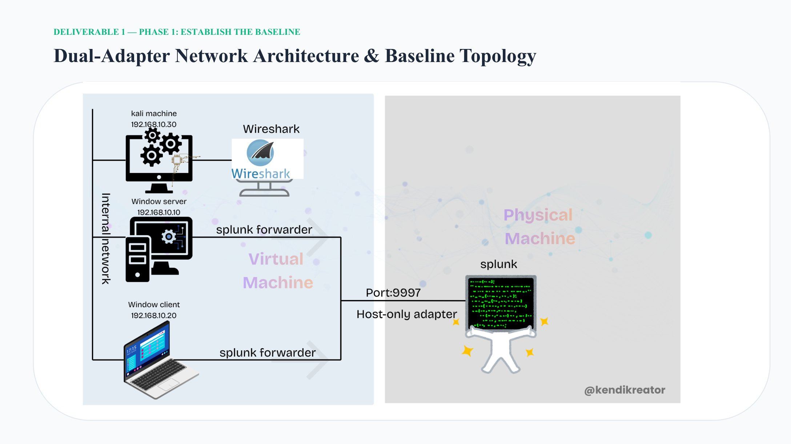
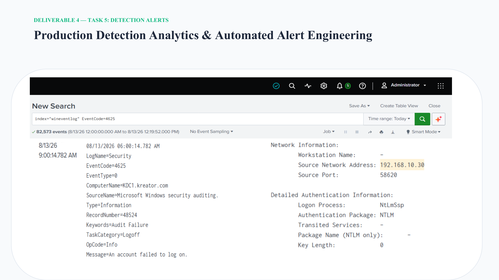
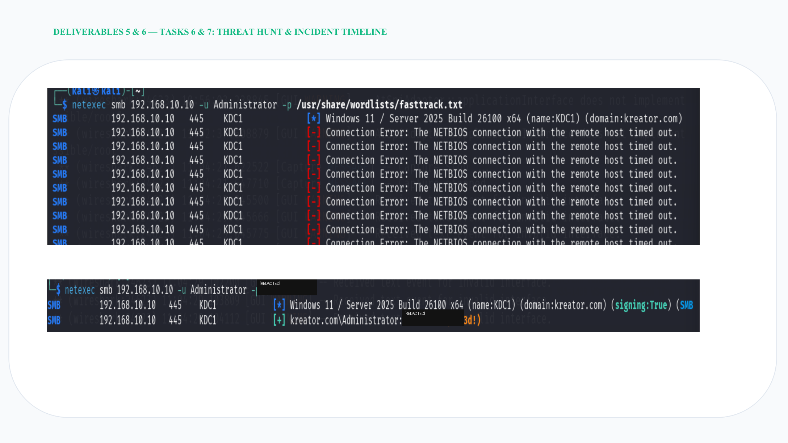
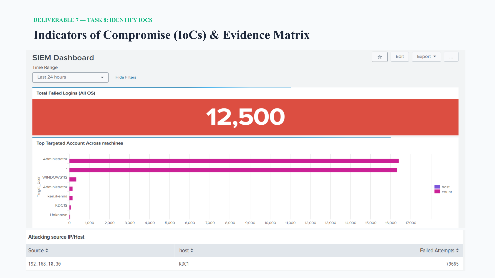

# OPERATION MARTINS
## Simulated Breach Investigation & SOC Defense Architecture

> A defensive SOC portfolio project covering network baselining, traffic inspection, SIEM telemetry, detection, threat hunting, IoC analysis, and incident response in an isolated virtual testbed.

**Author:** Martins Jesurobo  
**Role:** Lead Security Investigator / Defense Presenter  
**Environment:** `soc-sandbox` isolated virtual testbed  
**Target organization:** MartinsPay Technologies / Martins Logistics

---

## 1. Project Objective

Operation Martins demonstrates an end-to-end SOC investigation workflow in a controlled lab environment. The objective is to establish a defensible baseline, observe network and authentication activity, centralize security telemetry in Splunk, identify suspicious behavior, correlate indicators, and execute a structured incident-response process.

The project is organized around eight deliverables:

1. Establish the baseline
2. Inspect network traffic
3. Build the log-ingestion/SIEM pipeline
4. Engineer detection alerts
5. Conduct threat hunting
6. Build the incident timeline
7. Identify Indicators of Compromise (IoCs)
8. Execute incident response and recovery

---

## 2. Environment

The report describes an isolated virtual testbed containing an Active Directory/domain environment, a Windows workstation, a Kali Linux system used as the simulated red-team source, and a Splunk SIEM host.

| Asset | IP address | Function |
|---|---|---|
| Domain Controller / KDC1 | `192.168.10.10` | Domain services and authentication |
| Windows workstation | `192.168.10.20` | Client endpoint |
| Kali Linux | `192.168.10.30` | Simulated red-team source |
| SIEM host | `192.168.56.1` | Splunk ingestion |

The documented architecture uses a dual-adapter design, with the host-only path used for SIEM ingestion.

---

## 3. Architecture

The baseline architecture establishes the expected communication paths between the domain environment and the SIEM.

### Expected services and ports

| Service | Port | Purpose in the lab |
|---|---:|---|
| DNS | `53` | Domain name resolution |
| Kerberos | `88` | Authentication tickets |
| LDAP | `389/TCP` | Directory communication |
| SMB | `445/TCP` | File/domain policy communication |
| MSRPC | `135/TCP` | Windows RPC communication |
| Splunk ingestion | `9997/TCP` | Forwarded security telemetry |



[Detailed architecture notes](docs/architecture.md)

---

## 4. Technologies Used

- **Kali Linux** — simulated red-team platform in the isolated lab
- **Nmap** — service discovery / reconnaissance evidence
- **NetExec** — SMB/domain interaction evidence
- **Wireshark** — packet and traffic inspection
- **Splunk** — centralized log analysis and detection
- **Windows Event Viewer** — endpoint event validation
- **Active Directory Users and Computers** — account containment/remediation
- **Group Policy** — account lockout hardening
- **Windows Server / Windows workstation** — target infrastructure

The repository intentionally documents only technologies supported by the submitted project evidence.

---

## 5. Investigation Scenario

The investigation models suspicious authentication activity against the domain environment. The documented red-team source is the Kali host at `192.168.10.30`, while the Domain Controller is `192.168.10.10`.

The evidence shows reconnaissance and SMB-related activity followed by repeated failed authentication events. The SOC workflow then correlates the source, validates whether successful authentication occurred, checks for persistence indicators, and moves into containment and recovery.

The project is a **simulation in an isolated testbed**, not a production incident.

[Investigation scenario and project summary](docs/project-summary.md)

---

## 6. Detection Methodology

The detection workflow is based on Windows authentication telemetry collected by Splunk.

### Primary signal

The investigation used:

```text
index=* EventCode=4625
```

EventCode `4625` was used to isolate failed logon activity. The investigation then traced the suspicious source back to `192.168.10.30`.

### Validation

The response process also checked:

- EventCode `4624` — to validate successful authentication activity
- Event `7045` — to check for rogue service installation
- Event `4720` — to check for unexpected account creation

This creates a practical detection-to-validation chain rather than treating one alert as proof of compromise.



[Detection and alerting notes](splunk/detection-and-alerting.md)

---

## 7. Threat-Hunting Methodology

The threat hunt follows a hypothesis-driven sequence supported by the evidence in the report:

1. Establish the normal network baseline.
2. Identify abnormal SMB/authentication behavior.
3. Query centralized authentication telemetry.
4. Pivot from the event to the source IP.
5. Correlate the source with the affected host/account.
6. Search for evidence of successful access.
7. Check for persistence through service installation and account creation events.
8. Use the resulting evidence to drive containment and recovery.



[Threat-hunting findings](threat-hunting/threat-hunt-findings.md)

---

## 8. IoC Analysis

The investigation identified the following indicators and evidence points:

| Indicator / evidence | Value | Significance |
|---|---|---|
| Suspicious source IP | `192.168.10.30` | Kali host identified as the source of repeated failed authentication activity |
| Failed logon event | `4625` | Primary detection signal |
| Successful logon validation | `4624` | Used to investigate whether successful authentication occurred |
| Service-install event | `7045` | Checked for persistence via rogue services |
| User-creation event | `4720` | Checked for unexpected account creation |
| Target | `KDC1 / 192.168.10.10` | Domain Controller associated with the activity |

The submitted dashboard displays **12,500** as its headline failed-login metric. The evidence table on the same dashboard also shows **79,665** failed attempts for source `192.168.10.30`. These are presented as separate dashboard views/metrics and should not be merged into one figure without the underlying Splunk search/export.



[IoC evidence matrix](iocs/ioc-matrix.md)

---

## 9. Incident-Response Process

The response follows four phases:

### Identification & Detection

Splunk was queried for EventCode `4625` and the failed authentication activity was traced to the Kali source.

### Containment

The documented response blocked the Kali IP at the network boundary and disabled the targeted Administrator account in Active Directory Users and Computers.

### Eradication

The documented response terminated active SMB connections and checked for successful authentication, rogue services, and unexpected user creation.

### Recovery

The affected account was reset, re-enabled, and an Account Lockout Policy was enforced through Group Policy to reduce the risk of automated brute-force activity recurring.


[Incident-response report](incident-response/incident-response-report.md)

---

## 10. Results

The investigation produced a complete defensive workflow from baseline establishment through recovery.

Key documented outcomes include:

- Suspicious authentication activity was detected in Splunk.
- The activity was correlated to the Kali source `192.168.10.30`.
- The Domain Controller was identified as the targeted host.
- Containment actions were performed against the source and targeted account.
- Validation checks were performed for successful logons and common persistence indicators.
- Account credentials were reset and an Account Lockout Policy was applied.

The evidence package is mapped directly to the original project report pages in [`evidence/README.md`](evidence/README.md).

---

## 11. Technical Reproducibility

This repository separates **what the submitted evidence demonstrates** from information that was not provided in the report.

### Reconstructable from the evidence

A technically competent analyst can reproduce the documented investigation flow by understanding:

- The four documented hosts and IP addresses.
- The expected services and ports.
- The dual-adapter / host-only SIEM architecture.
- The reconnaissance and SMB activity shown in the evidence.
- The Splunk EventCode `4625` investigation.
- The validation events `4624`, `7045`, and `4720`.
- The documented containment, eradication, and recovery actions.

### Deliberately not invented

The submitted PDF does **not** provide a complete VM specification, exact Splunk `inputs.conf`/`props.conf` configuration, complete Windows Group Policy export, raw PCAP, or a full Splunk search/export. Those artifacts are therefore not represented here as if they existed.

Where a screenshot contains a credential-like lab value, this repository does not reproduce the value in text.

[Reproducibility guide](docs/reproducibility.md)

---

## 12. Lessons Learned

- A reliable baseline makes anomalous behavior easier to recognize.
- SIEM visibility is most useful when endpoint events can be correlated to a network source.
- A failed-authentication alert should lead to validation and scoping, not an immediate assumption of successful compromise.
- Persistence checks should accompany authentication investigations.
- Incident response is stronger when containment, eradication, recovery, and hardening are documented as distinct phases.
- Portfolio evidence should be traceable to the underlying investigation rather than presented as unsupported screenshots.

---

## 13. Security Considerations

This project is intended for **authorized cybersecurity training and portfolio demonstration** in an isolated environment.

- Do not apply the documented activity to systems without authorization.
- Do not publish real credentials, tokens, private keys, or production secrets.
- Treat all IP addresses and hostnames here as lab artifacts.
- Review screenshots before public release for accidental sensitive information.
- The repository does not claim that the lab reproduces every production control or enterprise security dependency.

See [`SECURITY-NOTES.md`](SECURITY-NOTES.md).

---

## 14. Repository Structure

```text
operation-martins-soc-investigation/
├── README.md
├── SECURITY-NOTES.md
├── LICENSE
├── .gitignore
├── docs/
│   ├── Operation-Martins-Project-Report.pdf
│   ├── architecture.md
│   ├── project-summary.md
│   └── reproducibility.md
├── evidence/
│   ├── README.md
│   ├── 01-baseline-topology.png
│   ├── 02-traffic-analysis.png
│   ├── 03-splunk-log-ingestion-pipeline.png
│   ├── 04-threat-hunting.png
│   ├── 05-detection-alert.png
│   ├── 06-ioc-dashboard.png
│   └── 07-incident-response.png
├── iocs/
│   └── ioc-matrix.md
├── incident-response/
│   └── incident-response-report.md
├── network/
├── splunk/
│   ├── detection-and-alerting.md
│   └── log-ingestion.md
├── threat-hunting/
│   └── threat-hunt-findings.md
└── wireshark/
    └── traffic-analysis.md
```

---

## Author

**Martins Jesurobo**  
Cybersecurity | SOC | GRC | Security Operations
