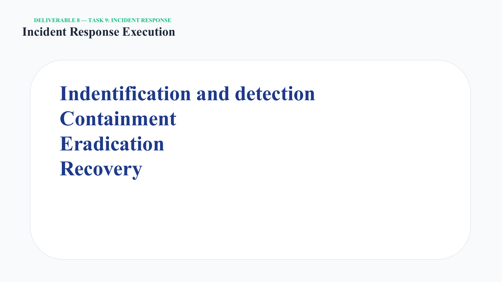

# Incident Response Execution

## 1. Identification & Detection

The investigation used Splunk to query EventCode 4625 and isolate repeated failed SMB logon attempts. The source was traced to the Kali host at `192.168.10.30`.

## 2. Containment

The reported response:

- Blocked the Kali source IP at the network boundary.
- Disabled the targeted Administrator account in Active Directory Users and Computers.

## 3. Eradication

The reported response:

- Killed active SMB connections.
- Checked Splunk for EventCode 4624 across the network.
- Verified in Event Viewer that rogue services (Event 7045) were not installed.
- Verified that unexpected backdoor users (Event 4720) were not installed.

## 4. Recovery

The reported response:

- Reset the affected account to a strong passphrase.
- Re-enabled the account.
- Enforced an Account Lockout Policy through Group Policy.

## Defensive outcome

The response moved the lab from detection to containment, validation, remediation, and preventive hardening.

