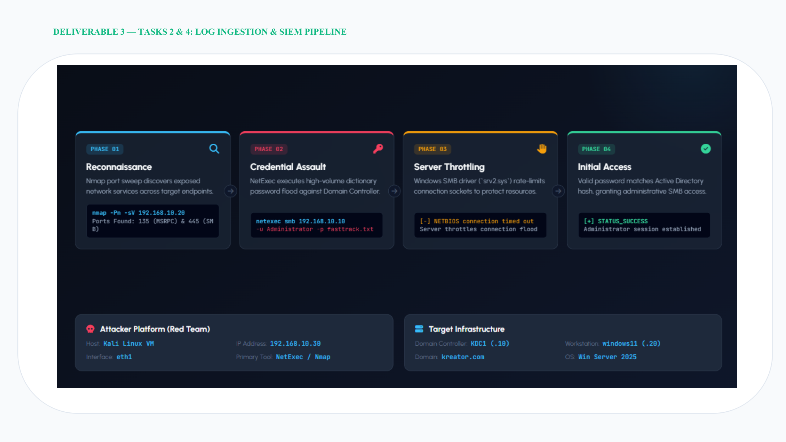

# Log Ingestion & SIEM Pipeline

The project uses Splunk as the central SIEM. The report describes Universal Forwarders on the server, Kali system, and workstation forwarding Windows Event Logs and Linux logs to Splunk.

The documented ingestion path uses TCP `9997` over the host-only adapter.

