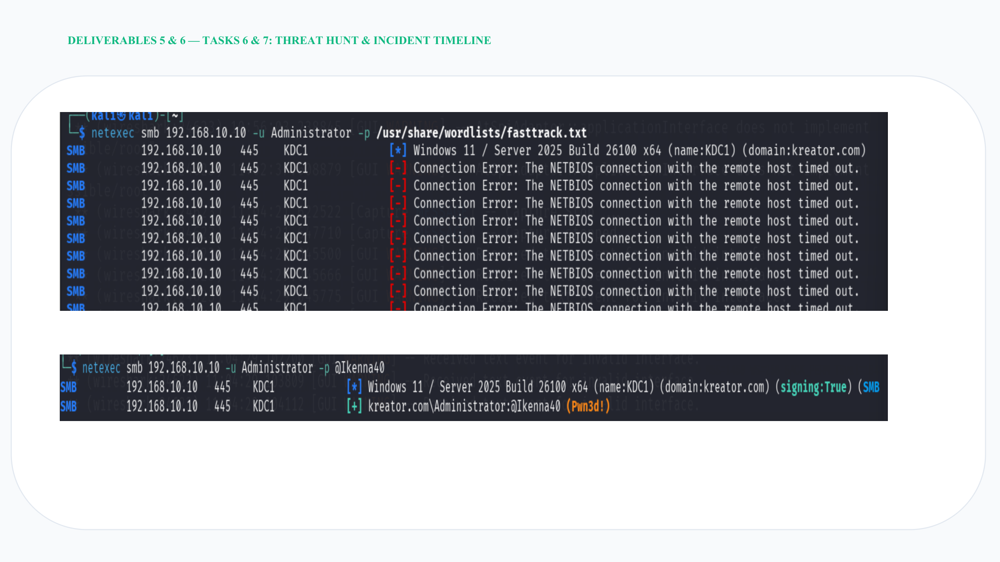

# Threat Hunt Findings

## Investigation focus

The threat-hunting phase examined authentication and SMB-related activity associated with the simulated breach.

The evidence shows repeated connection/authentication activity against the Domain Controller.

## Key finding

The suspicious source was identified as the Kali host at:

`192.168.10.30`

The project then moved from detection into incident-response actions.

