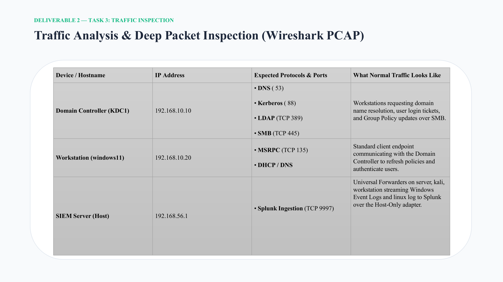

# Traffic Analysis & Deep Packet Inspection

## Objective

Establish expected network behavior and use packet-level evidence to support the SOC investigation.

## Baseline observations

The project report identifies:

- Domain Controller traffic involving DNS, Kerberos, LDAP and SMB.
- Windows workstation traffic involving MSRPC and DHCP/DNS.
- Log forwarding to Splunk over TCP `9997` through the host-only path.

## Investigation value

The baseline provides a reference for distinguishing normal domain activity from unusual authentication or SMB behavior.

## Evidence

